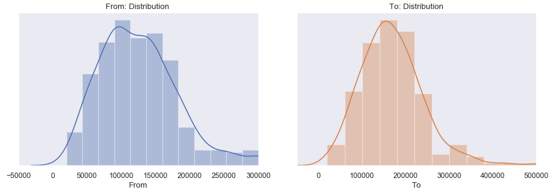
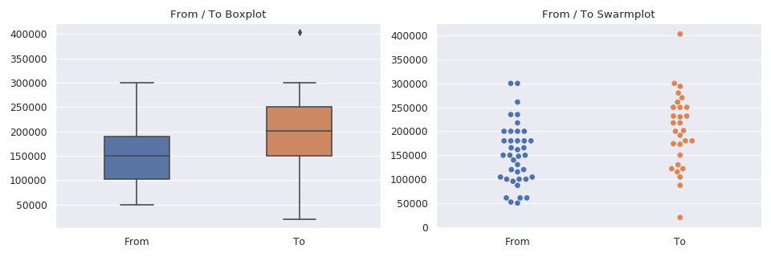
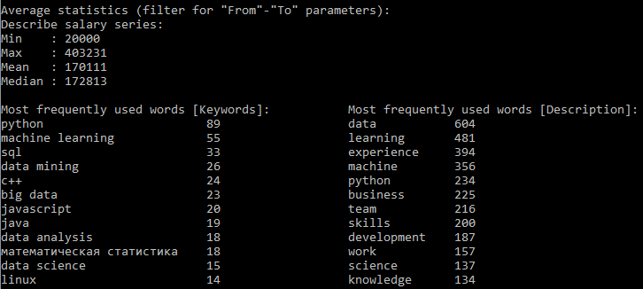
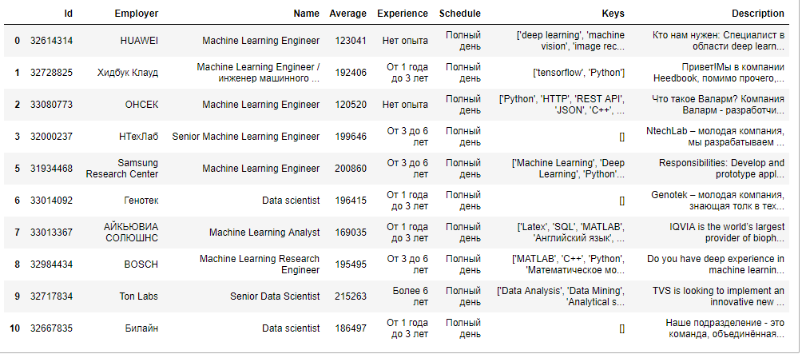

# Комплексный инструмент для анализа вакансий Data Science (DataEngineer, MLEngineer, DataAnalyst), размещенных на портале HeadHunter, построен с поддержкой контейнеризации Docker

**Идея**: проект упрощает поиск, анализ и исследование особенностей DS-вакансий на hh.ru.
Проект реализован с использованием лицензии GNU GPL 3.0.

### Общая информация


____

### Requirements
*Перечень всех зависимостей в requirements.txt*

```requirements.txt
matplotlib==3.2.1
nltk==3.4.5
numpy==1.18.2
pandas==1.0.3
pre-commit==2.8.2
requests==2.23.0
seaborn==0.10.0
tqdm==4.45.0
```

### Command line arguments
```bash
usage: parser.py [-h] [--text TEXT] [--max_workers MAX_WORKERS] [--refresh] [--save_result] [--update]

HeadHunter (hh.ru) vacancies researcher

optional arguments:
  -h, --help            show this help message and exit
  --text TEXT           Search query text (e.g. "Machine learning")
  --max_workers MAX_WORKERS
                        Number of workers for multithreading.
  --refresh             Refresh cached data from HH API
  --save_result         Save parsed result as DataFrame to CSV file.
  --update              Save command line args to file in JSON format.
```

### Config file
Все параметры находятся в конфигурационном файле:
```json
{
  "options": {
    "text": "Data Scientist",
    "area": 1,
    "per_page": 50
  },
  "refresh": false,
  "max_workers": 7,
  "save_result": false,
  "exchanges": ["RUB", "USD", "EUR", "UAH"]
}
```

### Input data
Входные данные - словарь ключевых значений, формирующих запрос.

**Основные параметры**:
- `area` - локация поискового запроса (пример: `{area: 1}` - Москва),
- `text` - поисковой запрос для вакансий (пример: `{text : Machine Learning}` или `{text: Java}`),
- `per_page` - количество вакансий на страницу, по умолчанию **50**.
и другие параметры (в зависимости от требуемого запроса).

Пример графика распределения зарплат:



### Run

Для запуска скрипта необходимо задать обязательный параметр ключевого запроса поиска. В системах Windows ключевой запрос в двойных кавычках! Например: `Machine Learning` или `JavaScript`.
Скрипт запускается из командной строки:

`python researcher.py --text "Python Developer"`

Можно задать параметр `--refresh`, который обновляет кешируемые данные о вакансиях. Для повторных запросов, отличающихся от первичного, это обязательный параметр.

`python researcher.py --text "Data Mining" --refresh`

### Processing
- Ответ от удаленного ресурса в виде json-массива для текущего курса валют: `{RUR, USD, EUR, UAH}`.
- На базе словаря **входных данных** формируется URL для запроса данных с hh.ru через API,
- Создается список всех `id` вакансий,
- Парсинг JSON в ответ на запрос по всем `id` вакансий,
    - Анализ параметра `salary` для формирования словаря зарплат:
        - Для зарплат, указанных в `USD` и `EUR` производится пересчёт по текущему курсу рубля,
        - Для зарплат, указанных до вычета НДФЛ производится пересчёт на реальную зарплату "на руки",
        - Для отсутствующих зарплат - пропуск.
    - Создаётся словарь ключевых элементов таблицы,
        - Массив содержит поля: `{колонки фрейма* -  (см. ниже)}`,
        - Для полей `From` и `To` происходит перерасчет зарплаты,
        - Ключевые навыки формируются как перечисляемый список,
        - Описание вакансий очищается от HTML-тегов с помощью дополнительной функции.
    - Функция возвращает массив кортежей.
- Преобразование сырых данных в `DataFrame` для дальнейшего анализа. Результат сохраняется на диск в виде `csv` файла.
- Анализ `DataFrame` - поиск статстических параметров, поиск мат. ожидания, медианы и т.д от зарплат. Классификация по параметрам.
- Предсказание зарплат для вакансий, у которых этот параметр не задан.
- Построение информативных графиков.

Пример графика для указанных зарплат:



**Колонки фрейма**:

| Параметр | Тип | Описание    |
| :-- | :-- | :-- |
| `Ids`           | `str`    | идентификатор вакансии (формирует ссылку на вакансию) |
| `Employer`     | `str`    | работодатель |
| `Name`         | `str`    | название вакансии |
| `Salary`       | `bool`   | указание зарплаты: `True / False` |
| `From`         | `float`  | нижний порог зарплаты |
| `To`           | `float`  | верхний порог зарплаты |
| `Experience`   | `str`    | опыт работы |
| `Schedule`     | `str`    | график работы |
| `Keys`         | `list`   | ключевые навыки |
| `Description`  | `str`    | описание вакансиии |

*Нижний и верхний порог зарплаты пересчитаны в рубли по текущему курсу валюты. Также для зарплат, указанных до вычета НДФЛ производится пересчёт на реальную зарплату "на руки".*

Пример наиболее часто используемых ключевых значений:



### Output data
Выходные данные - таблица в формате `csv`, созданная с помощью фреймворка `pandas`. Дополнительно к этой таблице проводится анализ: поиск мат. ожидания, медианы и т.д от зарплат в зависимости от остальных критериев в таблице (например, от опыта работы). Проводится классификация по различным параметрам.

Пример предсказанных зарплат:



[Документация API HeadHunter hh.ru](https://github.com/hhru/api "Head-Hunter API documentation")
